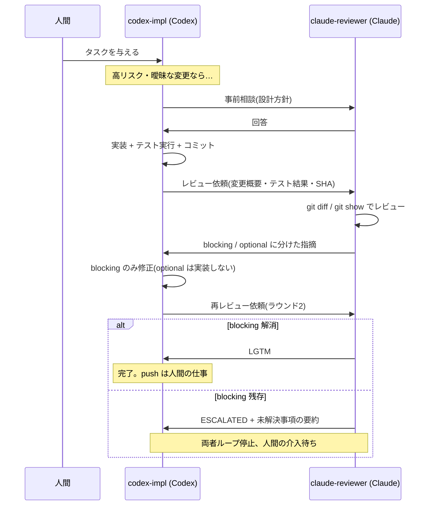

# アーキテクチャ

自律開発ペアがどう構成され、メッセージがどう流れるかの解説です。

## コンポーネント

```
<repo>/                     ← ユーザーの本来の作業ツリー(ペアは一切触れない)
<repo>-agent/               ← 専用 worktree(ブランチ: agent/autonomous)
├── AGENTS.md               ← Codex のロール定義(セッション開始時に読む)
├── CLAUDE.md               ← Claude のロール定義(同上)
└── .agent/
    ├── config.sh           ← チーム名・エージェント名・パス等の共有設定
    └── bin/
        ├── team            ← start/stop/status/logs/restart/doctor
        ├── launch-claude-reviewer.sh
        └── rollback.sh

~/.agents/skills/agmsg/     ← agmsg 本体
├── db/messages.db          ← メッセージストア(SQLite, WAL モード)
├── teams/                  ← チーム・メンバー定義
├── run/                    ← ブリッジ等のランタイム状態
└── scripts/                ← send.sh / delivery.sh / join.sh など

~/.codex/config.toml        ← Codex のサンドボックス設定(マシン共通)
```

- **デーモンは存在しない。** すべての通信は SQLite ファイル経由で、送信は `send.sh` の一回きりの実行、受信は各 CLI の配信機構が担う。
- tmux セッション(既定: `<repo名>-agents`)に 2 ペインを作り、片方で Claude Code、もう片方で Codex を常駐させる。

## メッセージ配信

| エージェント | 配信モード | 仕組み |
|---|---|---|
| Claude Code | `both` | Monitor ツールでリアルタイム受信(primary)+ ターン間チェック(fallback) |
| Codex | `monitor`(ベータ) | app-server を経由するブリッジが対話セッションにメッセージを注入 |

Codex 側のブリッジと app-server のライフサイクルは `.agent/bin/team` が管理します(start で起動、stop で終了)。

## 開発ループ



ポイント:

- **役割の完全分離** — Codex だけがファイルを編集し、Claude はレビュー成果物(`.agent/reviews/` 配下)以外を一切書かない。git 状態も変更しない。
- **ラウンド上限 2** — 無限レビューループを構造的に防ぐ。上限到達で `ESCALATED` を宣言し必ず人間に返す。
- **optional 指摘は実装しない** — レビュー指摘の膨張によるスコープクリープを防ぐ。

## send.sh の呼び出し規約

引数は 4 つの位置引数で固定です(順序を変えるとメッセージが宛先に届きません):

```bash
~/.agents/skills/agmsg/scripts/send.sh <team> <from> <to> "<message>"
```

Monitor ツールの `watch.sh <session_id> <project_path> <agent_type>` とはシグネチャが異なるので混同しないこと(実際に混同事故が起きたため、両ロールファイルに明記してあります)。

## 名前の導出規則

setup.sh はリポジトリ名から各種名前を導出します:

```
repo名 → 小文字化 → [^a-z0-9-] をハイフンに置換 → ハイフン連続を圧縮

例: My_Repo.js → my-repo-js
    チーム名: my-repo-js-agents
    worktree: ../my-repo-js-agent
    tmux:     my-repo-js-agents
```

これにより複数リポジトリで同時にペアを走らせても、チーム・tmux セッション・worktree が衝突しません。
